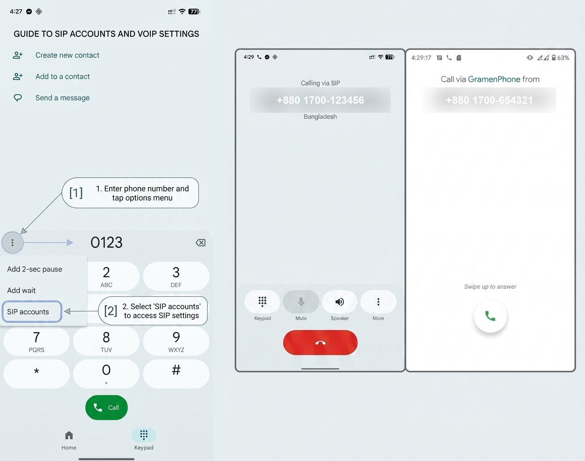
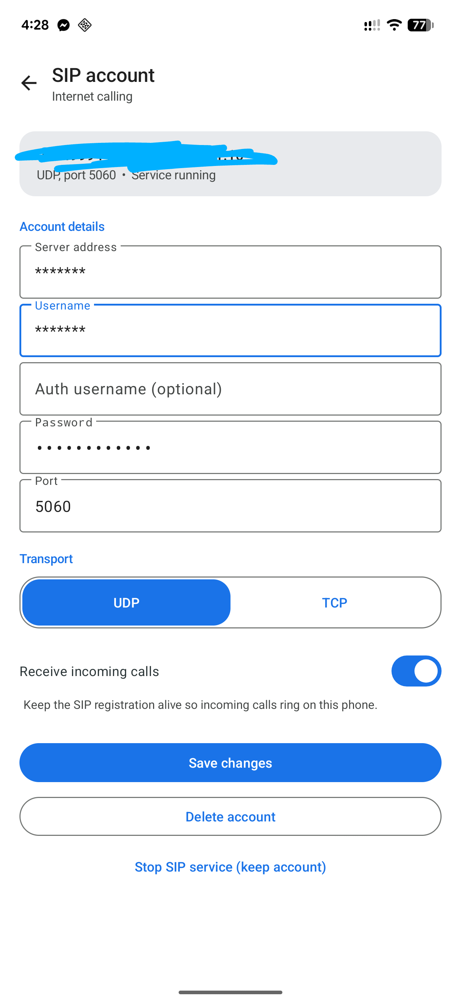
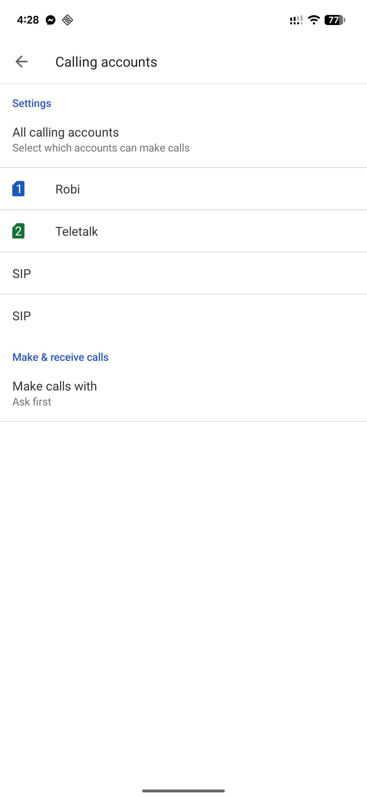

<p align="center"></p>

# Dialer SIP Mod

Real SIP calling on Android, two ways:

- **Rooted** — a modified Google Phone (com.google.android.dialer) with a
  bundled [PJSIP](https://github.com/pjsip/pjproject) 2.15.1 stack, spliced
  in at the smali level. SIP calls look and behave exactly like cellular
  calls: same dialer, same call log, same in-call screen, SIM/SIP chooser.
- **Non-rooted** — `DialerSIP-standalone`, the same SIP stack shipped as a
  normal installable app. No root needed; calls still ring through the
  stock dialer's in-call UI and land in the system call log via the public
  Telecom ConnectionService API.

> Personal modding project, published for educational purposes. The rooted
> variant modifies Google's proprietary Dialer — personal use only. The
> Java sources in `app/src` and the build scripts are original code (MIT).

## Downloads (Releases)

| Asset | For | Install |
|---|---|---|
| `dialer-sip-mod-module-*.zip` | Rooted (Magisk) | Magisk → Install from storage → reboot |
| `GoogleDialer-SIP-*.apk` | Rooted | `pm install -r` over an existing module install (same signing key) |
| `DialerSIP-standalone-*.apk` | **Any device** | Normal install (sideload); see setup below |

## Requirements

**Rooted variant:** Magisk, arm64, Android 11–16 (minSdk 30, targetSdk 37),
Google Dialer 233.x as `/product/priv-app/GoogleDialer`.

**Standalone variant:** Android 11+ (tested on 16), arm64. Grant the
phone/notifications permissions when asked, then toggle the SIP account on
once under **Settings → Calling accounts** (auto-enable needs a privileged
permission only the rooted variant has).

## Features

- SIP calls in the stock experience: account chooser (SIM/SIP), stock
  in-call UI, call log with caller ID (`P-Asserted-Identity` →
  `Remote-Party-ID` → `From` parsing; numbers match contacts).
- **SIP settings UI**: rooted variant adds a "SIP accounts" entry to the
  dialpad overflow (⋮) menu; both variants have the app/notification/
  shortcut entry points. Material 3 screen (Google-blue palette, automatic
  dark mode) to add, edit, delete the account and start/stop the service.
- Incoming-call hand-off through a thread-safe queue; a call Telecom has
  not claimed within 8 s is answered **486 Busy** so callers never ring
  into a void.
- Explicit pjsua2 `Call` lifetime management (strong refs + deferred
  `delete()` on the pjlib thread) — GC-finalizing a call aborts the app.
- Audio: WebRTC AEC, 16 kHz clock, G.711 + Opus (+ device AMR via
  MediaCodec), in-call volume boost, mic/speaker level boost.

## Repo layout

```
app/src/com/dialersip/   shared Java sources (both variants)
patches/                 smali patches for the decompiled dialer
  01 notification-channel cleanup crash fix
  02 GMS package-verification crash fix
  03 dialpad-overflow settings entry + theme resources
build/                   rooted build pipeline (splice script, module.prop)
standalone/              non-rooted variant (manifest, apktool.yml, build script)
```

## Architecture

- **SIP stack**: PJSIP 2.15.1 built from source for arm64-v8a, API 30,
  `--disable-ssl --disable-video --with-opus`.
- **Telecom integration**: a managed (non-self-managed) `ConnectionService`
  registers a `PhoneAccount` with `sip` + `tel` URI schemes. The rooted
  variant auto-enables the account (privileged); the standalone relies on
  the user toggling it in Calling accounts.
- **Threading**: all pjsua2 calls are marshalled onto one pjlib-registered
  handler thread. Calling pjlib from Telecom binder threads crashes
  natively — this is load-bearing.
- **Call flow**: place → INVITE via pjsua2; 180 Ringing keeps the
  connection in DIALING (never `setRinging()` on an outgoing connection);
  answer/reject/hangup posted to the SIP thread; media bridged to
  speaker/mic in `onCallMediaState` (pjsua2 does not auto-connect).
- **Keep-alive**: foreground service (`phoneCall|microphone` type) holds
  the registration, re-registers on network changes, restored after boot.
- **R8 gotcha** (for anyone extending the Material UI): the dialer's R8
  pass renamed several Material APIs (`MaterialToolbar.setTitle`,
  `MaterialButtonToggleGroup.setSingleSelection`, `TextInputLayout.setHint`,
  ...). Spliced code may only call methods defined in the Material class
  itself or the framework — see `patches/03`.

## Building from source

### 1. Toolchain (Windows user-space; no WSL needed)

```
JDK 17, Android SDK (platforms;android-36, build-tools;36.0.0, ndk;28.2.13676358)
swig 4.5 (pip install swig), MSYS2 make 4.4 (runs under Git Bash), apktool 3.0.3
```

### 2. Native stack

```bash
# Opus (arm64, static)
cmake -G Ninja -DCMAKE_TOOLCHAIN_FILE=$NDK/build/cmake/android.toolchain.cmake \
  -DANDROID_ABI=arm64-v8a -DANDROID_PLATFORM=android-24 -DBUILD_SHARED_LIBS=OFF \
  -DOPUS_BUILD_PROGRAMS=OFF -DOPUS_BUILD_TESTING=OFF -DCMAKE_INSTALL_PREFIX=<prefix> <opus-src>

# pjproject 2.15.1
export ANDROID_NDK_ROOT=<ndk>
./aconfigure --host=aarch64-linux-android \
  --disable-ssl --disable-video --with-opus=<prefix> \
  CC=<ndk-clang> CXX=<ndk-clang++> AR=llvm-ar RANLIB=llvm-ranlib CFLAGS=-fPIC
# config_site.h: #define PJ_CONFIG_ANDROID 1 + include <pj/config_site_sample.h>
make dep && make -j8
cd pjsip-apps/src/swig/java && make TARGET_ARCH=arm64-v8a   # pjsua2 + libpjsua2.so
```

### 3. Rooted variant

```bash
apktool d com.google.android.dialer.apk dialer_decompiled
# apply patches/01, 02, 03 (see file headers)
bash build/build_splice.sh                 # compile->dex->baksmali->splice into the tree
apktool b dialer_decompiled -o unsigned.apk
zipalign -f -p 4 unsigned.apk aligned.apk
apksigner sign --ks <your.keystore> --out rooted.apk aligned.apk
# Magisk module: system/product/priv-app/GoogleDialer/GoogleDialer.apk + build/module.prop
```

### 4. Non-rooted variant (after the rooted splice has produced smali_classes6)

```bash
bash standalone/build_standalone.sh        # -> DialerSIP-standalone.apk
# sign with your own keystore via KS=/KS_ALIAS=/KS_PASS= env vars
```

## Installing (rooted)

1. Flash the module zip in Magisk, reboot.
2. If a `/data/app` update of the dialer exists:
   `pm uninstall -k --user 0 com.google.android.dialer` then reboot, then
   `pm install-existing --user 0 com.google.android.dialer`.
3. Future builds signed with the same key update via `pm install -r` — no
   reboot. Disable the module + reboot to return to stock.

## Screenshots

| SIP account screen | Calling accounts |
|---|---|
|  |  |

## Setting up your SIP account

You need a SIP account first — any ITSP / VoIP provider works (a plain
username + password + server, no OAuth). Then:

1. **Open the SIP settings**
   - *Rooted:* open the Google Phone dialpad → tap **⋮ → SIP accounts**.
   - *Standalone:* launch the **Dialer SIP** app icon.
2. **Fill in the account** (screenshot 1):
   - **Username** — the SIP user the provider gave you (usually your
     account number)
   - **Password** — the SIP/auth password
   - **Server** — the SIP server host or IP (e.g. `sip.example.com`)
   - **Auth username** — only if the provider uses a separate auth user;
     otherwise leave it equal to the username
   - **Port / Transport** — `5060` UDP for most providers; switch to TCP
     only if they say so
   - **Receive incoming calls** — leave on unless you want outgoing-only
3. **Save.** The service starts and registers; the status card turns
   **Registered ✓ (200)**, usually within a second or two. If it says
   `401/403` re-check username/password; `timeout` means server, port or
   transport is wrong.
4. **Enable the account for calling**
   - *Rooted:* already enabled automatically.
   - *Standalone:* open system **Settings → Calling accounts → SIP** and
     set **Make calls with: Ask first** (screenshot 2). One-time only.
5. **Make a call** — dial any number in the dialer and pick **SIP** in
   the chooser. To dial another SIP user directly, enter the full URI,
   e.g. `12345678@sip.example.com`.
6. **Receive calls** — they ring through the stock in-call UI with the
   caller's number (taken from `P-Asserted-Identity` when the provider
   sends it), and land in the normal call log.

Run only one variant per SIP account at a time — two registrations of
the same account will double-ring.

Diagnostics: `adb logcat -s DialerSip PjsipTrace`.

## FAQ

**Play Store updates?** The rooted APK is re-signed, so the Play Store can
never overwrite it. Keep both variants of the same SIP account from
registering at once (double ringing) — run one at a time.

**Other dialer versions?** The patches target dialer 233.x; other versions
need the patches re-applied by hand. The Java sources and pipelines are
version-independent.

**Privacy?** Nothing leaves the device except SIP traffic to the server you
configure. No telemetry added; Google's attestation is neutralized in the
rooted variant (a re-signed APK can never pass it).

## Known limitations

- While a cellular call is active/connecting, this ROM's Telecom aborts
  incoming-call creation for third-party connection services; the mod
  answers 486 after 8 s so the caller gets busy (the aborted call is logged
  by the system as a numberless missed entry).
- Outgoing calls show no "via SIP" badge (stock behavior for third-party
  accounts); outgoing call-log entries record the dialed SIP URI.
- No hold, no TLS, arm64 only. Call recording is parked on `dev-recording`.
- Standalone: no dialpad-overflow entry inside the system dialer.

## License

Original code in `app/src`, `build/`, `standalone/` and the patches: MIT.
PJSIP and Opus carry their own licenses. The patched dialer APK contains
Google proprietary code — personal use only.
